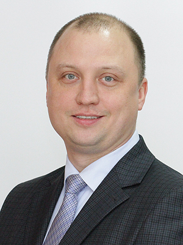

# Денис Степанов

## Контакты
8-920-100-47-37
stepandenis@mail.ru
## Обо мне:
### Образование
**Обучаюсь в Нетологии на Python-разработчика**

В марте 2010 года закончил Всероссийский заочный финансово-экономический институт с присуждением квалификации экономист по специальности «Финансы и кредит».

Окончил Ярославский техникум железнодорожного транспорта в 1999 году по специальности электромеханик

### Опыт работы

**В настоящее время работаю в ПАО ГК "ТНС энерго" в Департаменте клиентских сервисов**

### ПРОФЕССИОНАЛЬНЫЕ НАВЫКИ, ЗНАНИЯ, ЛИЧНЫЕ КАЧЕСТВА

- Аналитический склад ума, ответственность, целеустремленность, коммуникабельность
- Опыт ведения деловых переговоров, деловой переписки, бумажного и электронного документооборота, обеспечение качества работы и исполнительной дисциплины
